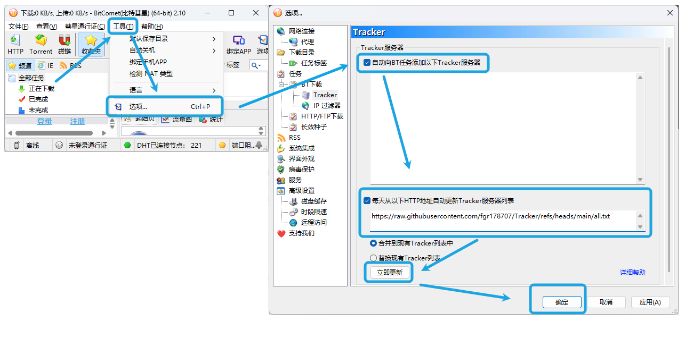
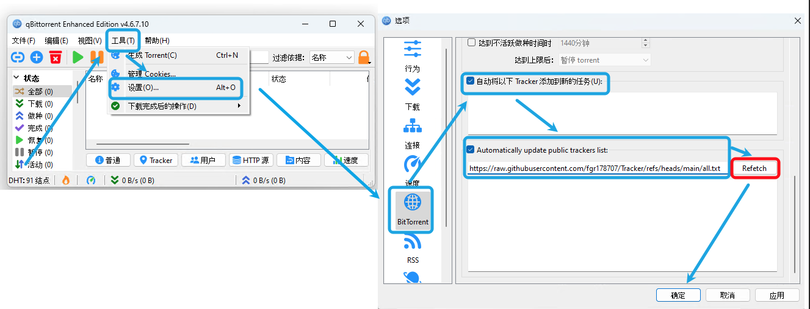
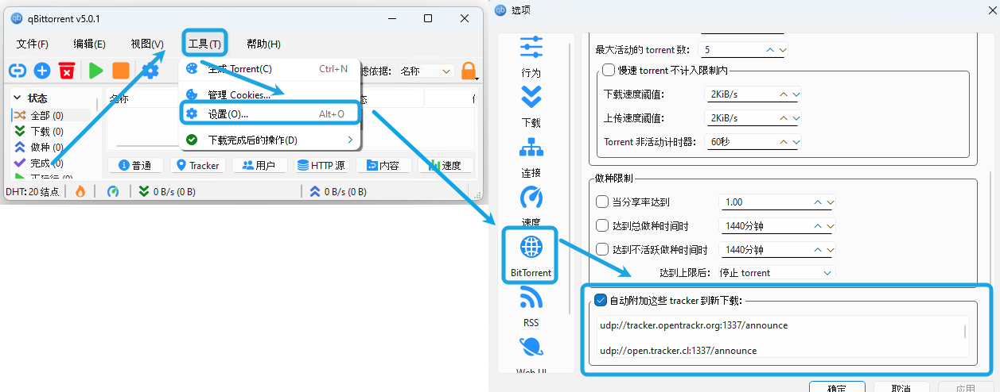

****

### 合集 
* https://github.com/fgr178707/Tracker/raw/main/all.txt 
*包含下方所有的 [Tracker](#项目来源)  目前为自动运行 GitHub Actions  UTC 时间 0 点对应北京时间次日 8 点*
 后续会根据 [TrackersListCollection](#xiu2trackerslistcollection) [trackerslist](#ngosangtrackerslist)更新时间进行调整
### 问题反馈 
* https://github.com/fgr178707/Tracker/discussions/new/choose

----

### 使用教程

#### BitComet (比特彗星):

> **官方网站：http://www.bitcomet.com** 

----

#### qBittorrent Enhanced Edition (增强版):
> **Github：https://github.com/c0re100/qBittorrent-Enhanced-Edition  **

----

#### qBittorrent:
> **官方网站：https://www.qbittorrent.org 需要通过浏览器打开网页全选内容复制粘贴 **

----

### 项目来源

该项目受到以下公共 Tracker 项目的帮助 感谢这些项目！

#### [XIU2/TrackersListCollection](https://github.com/XIU2/TrackersListCollection)
* https://raw.githubusercontent.com/XIU2/TrackersListCollection/master/all.txt
* https://raw.githubusercontent.com/XIU2/TrackersListCollection/master/best.txt
* https://raw.githubusercontent.com/XIU2/TrackersListCollection/master/http.txt

#### [ngosang/trackerslist](https://github.com/ngosang/trackerslist)
* https://raw.githubusercontent.com/ngosang/trackerslist/master/trackers_best.txt
* https://raw.githubusercontent.com/ngosang/trackerslist/master/trackers_all.txt
* https://raw.githubusercontent.com/ngosang/trackerslist/master/trackers_all_udp.txt
* https://raw.githubusercontent.com/ngosang/trackerslist/master/trackers_all_http.txt
* https://raw.githubusercontent.com/ngosang/trackerslist/master/trackers_all_https.txt
* https://raw.githubusercontent.com/ngosang/trackerslist/master/trackers_all_ws.txt

****
